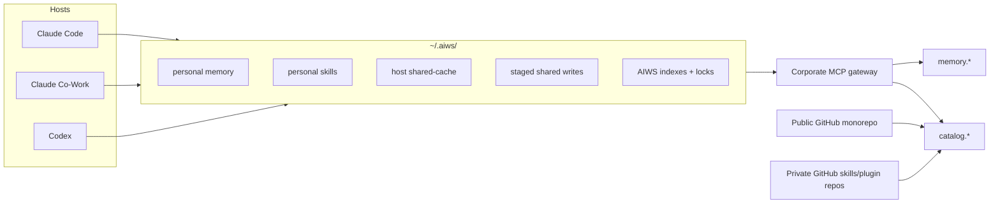
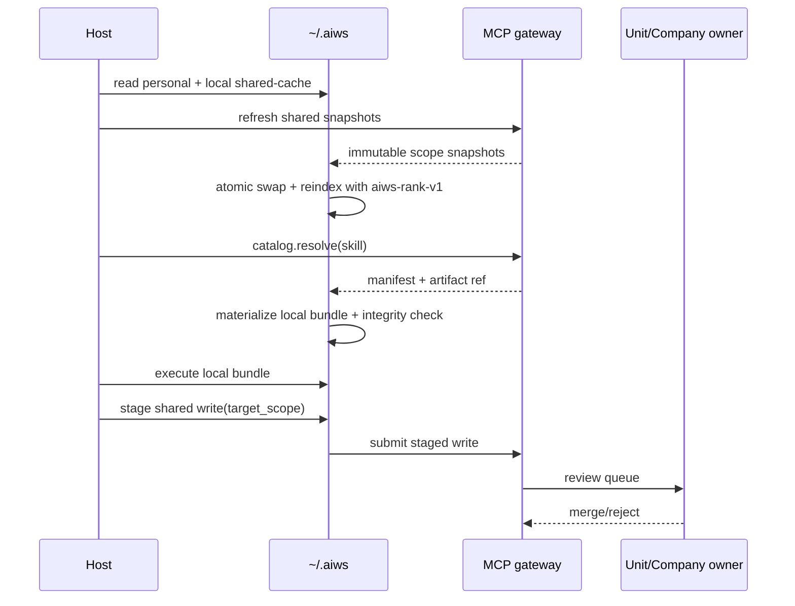

# Target-State AIWS Architecture: Local Personal Memory + Corporate Shared Scopes

## Summary

- `personal` is canonical and local under `~/.aiws/`.
- `unit:<id>` and `company` are governed shared scopes behind one corporate MCP gateway.
- `public` is not a memory scope. It is distribution only: public skills, schemas, contracts, bootstrap assets, and platform code.
- Claude Code, Claude Co-Work, and Codex are thin adapters over the same AIWS local/runtime contract.
- Skills are resolved through a catalog, materialized locally, and executed locally. Remote skill execution is out of scope.
- Shared writes are staged locally, then reviewed and merged by the target owner.





## Key Contracts

- Normative local layout:

```text
~/.aiws/
├── personal/
│   ├── memory/
│   └── skills/
├── hosts/<host-id>/
│   ├── shared-cache/memory/
│   ├── shared-cache/skills/
│   └── staged-writes/
└── state/
    ├── indexes/
    ├── locks/
    └── sync-metadata/
```

- Shared gateway contracts:
  - `memory.search(query, actor, allowed_scopes)`
  - `memory.get(ref)`
  - `memory.submit(stage_ref)` for explicit `unit:<id>` or `company` only
  - `catalog.resolve(skill_ref, actor, host_id)`
  - `catalog.get(manifest_ref)`

- Memory read contract:
  - Reads are against one local composed view only: `personal` + host-local shared-cache.
  - Scope order is ordering only, not suppression: `personal`, then `unit:<id>` groups sorted by `unit_id`, then `company`.
  - Within a scope group: `score desc`, then `updated_at desc`, then `record_id asc`.
  - Multi-unit conflicts remain separate records with provenance: `scope_id`, `record_id`, `version`, `updated_at`.
  - Hosts must not synthesize a single canonical record from conflicting unit records.

- Shared snapshot/index contract:
  - Shared reads are `Local Cache First`; the gateway is not on the critical path for each turn.
  - Every snapshot carries `{scope_id, snapshot_version, source_watermark, refreshed_at}`.
  - Refresh writes to temp and atomically swaps the active snapshot.
  - AIWS owns indexing under `~/.aiws/state/indexes/`.
  - Canonical scorer is `aiws-rank-v1`; hosts may not substitute their own scorer.
  - Any personal-memory or snapshot version change invalidates the affected index before swap completes.
  - Reads use only the last complete active snapshot and last complete active index.

- Skill/catalog contract:
  - GitHub-backed plugin marketplace repos are the source of truth for shared skill distribution.
  - Public repos distribute public plugin variants.
  - Company and unit/project repos are private or internal GitHub repos, for example `github.com/owner/repo`.
  - Personal skills live under `~/.aiws/personal/skills/`.
  - A logical skill is `plugin_id + skill_id`; a concrete variant is `(scope, marketplace_repo, plugin_id, skill_id, version_or_commit, integrity_hash)`.
  - The same logical skill may exist in multiple scoped repos. These are scoped variants, not one shared file.
  - Duplicate visible skill variants fail closed unless the caller or an explicit organization policy pins one variant.
  - `core-aiws` owns the internal skill-management bridge for editable drafts, draft activation, GitHub updates, and PR submission. It is not a separate user-facing plugin.
  - Editable draft state is recorded under `~/.aiws/state/skill-drafts/`; editable files live under `~/.aiws/plugins/<marketplace-slug>/<plugin-id>`.
  - Managed skill folders remain compatible with Codex `skill-creator`: `SKILL.md` frontmatter contains only `name` and `description`, and the folder name matches `name`.
  - Required manifest fields: `skill_id`, `scope`, `version`, `artifact_kind`, `entrypoint`, `supported_hosts`, `required_tools`, `artifact_ref`, `integrity_hash`.

- Local skill execution contract:
  - Canonical bundle type is `aiws-skill-bundle-v1`.
  - Canonical materialization path is `~/.aiws/hosts/<host-id>/shared-cache/skills/<scope-id>/<skill-id>/<version>/`.
  - `entrypoint` is a relative path to a UTF-8 markdown skill file; default `SKILL.md`.
  - Optional support assets: `agents/`, `references/`, read-only only.
  - Bundles may not declare host-native commands or host-specific tool names.
  - `required_tools` use the AIWS capability vocabulary, for example: `fs.read`, `fs.write`, `shell.exec`, `python.exec`, `git.read`, `git.write`, `memory.read`, `memory.write-stage`, `catalog.resolve`, `mcp:<namespace>.<tool>`.
  - Hosts map native tools to that vocabulary or fail closed.

- Shared write contract:
  - Shared writes are local stage + explicit sync.
  - Staged writes require explicit target scope and include provenance + idempotency metadata.
  - Gateway authz is server-side.
  - Unit/company owners review and merge; hosts never auto-merge shared writes.

## Test Plan

- Same-machine cross-host consistency: Claude Code, Claude Co-Work, and Codex return the same ordered local results from the same snapshots and index metadata.
- Multi-unit memory read returns separate provenance-preserving records; duplicate shared skill ids fail closed without scope pinning.
- Snapshot refresh is atomic: readers never see half-written snapshots or half-built indexes.
- Personal writes and shared refresh are concurrent-safe under AIWS locks.
- Gateway outage or token failure leaves hosts in local read-only degraded mode.
- Skill bundle fails closed on unsupported host, missing required capability, bad integrity hash, or unresolved duplicate identity.
- Shared write without explicit target scope is rejected before submission.
- Public artifacts remain executable only after local materialization, never directly from the repo.

## Assumptions / Defaults

- Target state only; migration sequencing is intentionally out of scope.
- Same-machine support only in v1 target state; cross-device personal sync is out of scope.
- One corporate MCP gateway per company environment.
- Remote skill execution is out of scope.
- Old plugin-first `public_*` terminology is replaced by `personal_memory`, `shared_memory`, `skill_catalog`, `public_catalog`, `host_cache`, and `staged_shared_write`.
